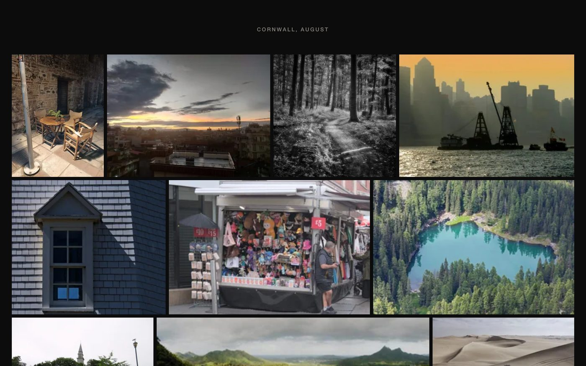
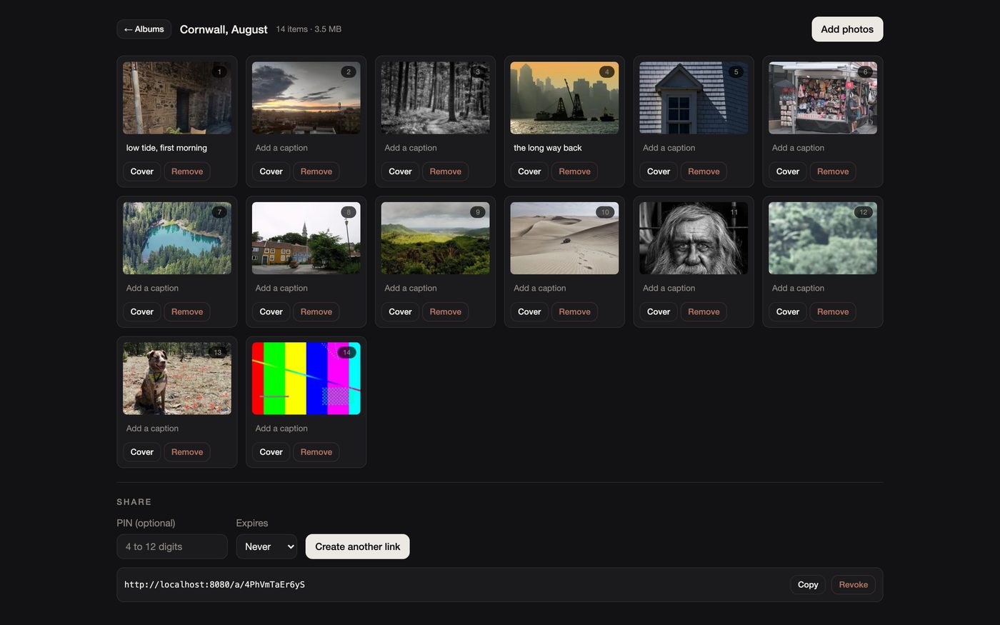

# Mantel

**Photo and video albums that are shared as a link.** The recipient opens it and sees the
photographs — no account, no app install, no cookie banner, no tracking, no "sign up to see more".

It is for someone who wants to send forty holiday photographs to family without routing them
through Google Photos, iCloud or a social platform. Storage is a side effect of sharing, not the
product. It is open source, self-hostable, and operable end to end by an AI agent.

## What a recipient sees



Photographs at their own proportions — nothing is cropped to make a tidy grid — with no header, no
logo, no share button and no interface of any kind until you ask for one.


## What a creator sees



One page. Drop photographs, watch them render, publish. Forty photographs from picker to shareable
link is five interactions.

## Live demo

**[https://albums.tennant.dev/a/86dTkGR5MJSX](https://albums.tennant.dev/a/86dTkGR5MJSX)** — a
permanent public album. It does not expire, and it needs no account, no app and no cookie.

Fourteen photographs, every one CC0. `docker compose up` gives you the same thing locally in about a
minute, and `just seed` fills it with the same album.

## Quick start

```
git clone https://github.com/alternayte/mantel && cd mantel
docker compose up --build
```

Then open http://localhost:8080/app, enter any email address, and read the sign-in link out of the
log:

```
docker compose logs app | grep magic-link
```

Three commands. [docs/getting-started.md](docs/getting-started.md) has the rest.

## Guarantees

Every row is a promise the code keeps, with the test that proves it. A guarantee without a passing
test is not listed here.

| Guarantee | Proved by |
|---|---|
| Media bytes never transit the API server | `UploadIntentTest` |
| Location data is stripped from every served derivative | `ExifStripTest` |
| A revoked share link returns 404 immediately | `ShareLinkRevocationTest` |
| An unprotected album sets no cookie of any kind | `NoCookieTest` |
| Quota is enforced before a presigned URL is issued | `QuotaPresignTest` |
| A crashed worker's claimed item returns to the queue | `ReclaimStaleTest` |
| An agent token cannot read another account's albums | `TokenScopeTest` |
| An interrupted large upload resumes without re-sending what arrived | `ResumableUploadTest` |

They run on every commit, against a real PostgreSQL and a real S3-compatible store, not mocks.

## What it is not

A backup product, a photo library, a social network, or a Google Photos replacement. There are no
viewer accounts, in any form, ever. There are no view counts, no referrer capture and no
fingerprinting: nothing is stored about a recipient at all.

Albums are unlisted and `noindex` by design. They are not meant to be found.

The documentation is also published at **[mantel.nate-andert.workers.dev](https://mantel.nate-andert.workers.dev)**.

## Documentation

| Document | What is in it |
|---|---|
| [getting-started.md](docs/getting-started.md) | Running it, making an album, working on the code |
| [configuration.md](docs/configuration.md) | Every value the app reads, and its default |
| [self-hosting.md](docs/self-hosting.md) | Running it for real: compose, storage, backups, upgrades |
| [api.md](docs/api.md) | The REST API, which is the same one the web client uses |
| [agents.md](docs/agents.md) | Scoped tokens, `llms.txt`, the MCP server |
| [android.md](docs/android.md) | The Android creator app: installing it, and building it signed |
| [operations/storage.md](docs/operations/storage.md) | Bucket lifecycle, incomplete uploads, reconciliation |
| [site/references/](site/references/) | The gauntlet's reference set, criteria and fixture album |
| [DESIGN.md](DESIGN.md) | The frozen design: tokens, and the reason for each decision |

## Roadmap

Honest status. A row with a version is intended work. "Not scheduled" is work nobody has committed
to.

| | Status |
|---|---|
| Albums, upload, sharing, PIN, expiry, revocation | Done |
| Photo and video processing, EXIF stripping | Done |
| Offline download bundle | Done |
| Scoped API tokens, `llms.txt`, OpenAPI, MCP | Done |
| Marketing site and documentation | Published |
| Public demo instance | Live |
| Android creator app (KMP + Compose), sideloaded | Done, 0.2.0 |
| Library, and phone backup with optional sync | Done, 0.3.0 |
| Hosted instance, plans and billing | Not scheduled |
| Search of the library: faces, places, text | Not scheduled |
| iOS | Not planned |
| HLS adaptive streaming | Not scheduled |
| Family spaces, guest upload, vanity slugs | Not scheduled |

## Self-hosting

One app container, one worker, PostgreSQL, and any S3-compatible bucket. Cloudflare R2 is the
default in deployment; MinIO stands in during development so presigned upload is exercised there
rather than discovered in production. See [docs/self-hosting.md](docs/self-hosting.md).

## Licence

**AGPL-3.0-or-later.** Mantel is a hostable consumer product, so a permissive licence invites
someone else to run the hosted service without contributing back. Infrastructure wants adoption; a
product wants its hosting rights. Self-hosting is a first-class path, and the licence is what keeps
it that way.
